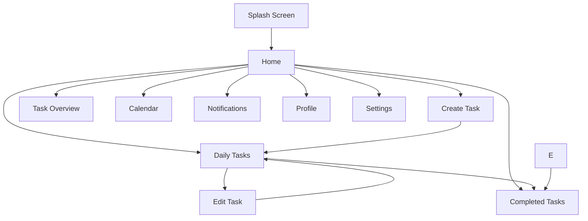
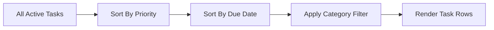
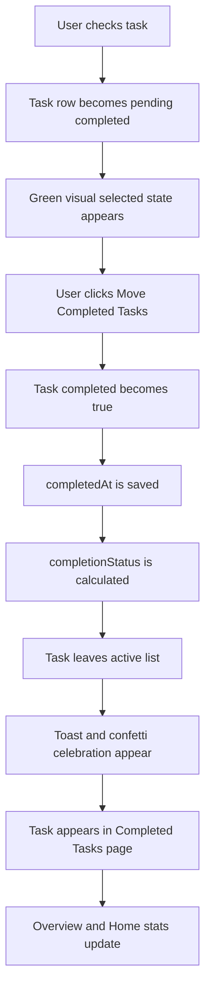
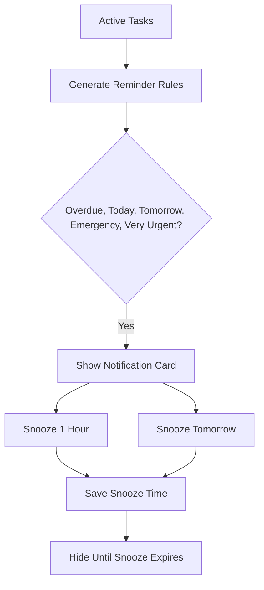
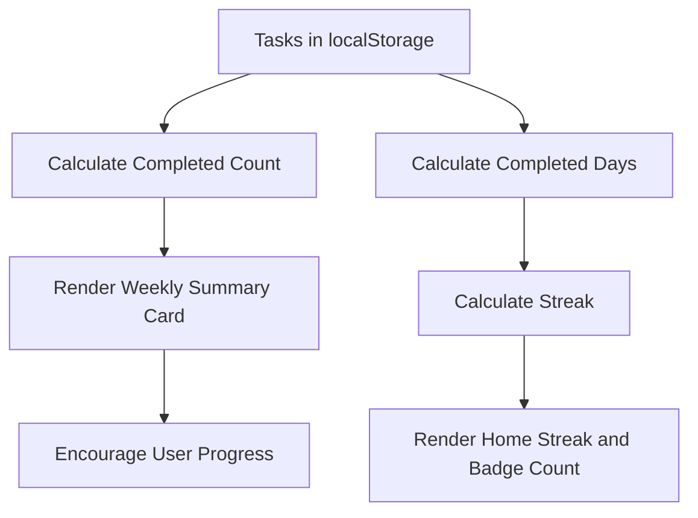

# Project Report: Your Best Reminder App

## 1. Project Summary

Your Best Reminder App is a complete responsive reminder and to-do list web app built with plain HTML, CSS, and Vanilla JavaScript. It uses a mobile-app style interface with a pink neon-orange theme, white cards, black bottom navigation, rounded corners, soft shadows, task priorities, categories, reminders, progress tracking, profile features, and local browser storage.

The project is designed to run locally through VS Code Live Server and to deploy as a static site on Vercel. It does not need a backend server, database, API, React, Vite, npm, or Node.js runtime for the final hosted app.

## 2. Technologies Used

- HTML5: used to create separate pages/screens for the app.
- CSS3: used for the full UI design, responsive layout, animations, mobile phone container, cards, forms, charts, priority colors, and theme.
- Vanilla JavaScript: used for task creation, editing, sorting, filtering, completion, calendar rendering, notifications, profile handling, settings, and localStorage operations.
- localStorage: used as the browser-side database.
- Browser Notification API: used for optional local reminder pop-ups when permission is granted.
- Vercel static hosting: used to host the app without a backend.

No external libraries are required.

## 3. Project Files

```text
splashscreen.html
home.html
create_list.html
edit_list.html
view_list.html
completed_tasks.html
overview.html
calendar.html
notifications.html
profile.html
setting.html
styles.css
app.js
README.md
PROJECT_REPORT.md
vercel.json
```

## 3.1 Code File Responsibilities

- `splashscreen.html`: contains only the splash screen structure and data attributes used by JavaScript for redirect timing.
- `home.html`: contains the dashboard markup, sidebar, search panel, motivation card container, category cards container, and bottom navigation.
- `create_list.html`: contains the task creation form and category/priority inputs.
- `edit_list.html`: contains the task editing form and delete button.
- `view_list.html`: contains the active task search bar, category filters, pending completion area, task list container, and bottom navigation.
- `completed_tasks.html`: contains completed task action buttons and the completed task list container.
- `overview.html`: contains summary cards, weekly summary container, donut chart markup, and legend.
- `calendar.html`: contains calendar selectors, calendar grid container, selected-date task list, and bottom navigation.
- `notifications.html`: contains the reminder list container and settings link.
- `profile.html`: contains the profile form area and dynamic profile card container.
- `setting.html`: contains language, notification permission, app information, and contact details.
- `styles.css`: contains all UI styling, responsive behavior, animations, colors, cards, fixed-phone scrolling, search UI, confetti, calendar, forms, and navigation.
- `app.js`: contains all application behavior, localStorage handling, rendering functions, search, sorting, completion, quote rotation, notifications, profile logic, calendar rendering, and settings.
- `README.md`: contains quick run/deploy instructions.
- `PROJECT_REPORT.md`: contains the full project explanation and submission report.
- `vercel.json`: configures Vercel to open `splashscreen.html` from the root URL.

## 4. Hosting Readiness

The app is ready for Vercel because it is a static project. Vercel can serve the HTML, CSS, and JavaScript files directly.

The project does not use `index.html` as the entry screen. Instead, it starts from `splashscreen.html`. The file `vercel.json` handles this:

```json
{
  "rewrites": [
    {
      "source": "/",
      "destination": "/splashscreen.html"
    }
  ]
}
```

This means that when users open the deployed website root URL, Vercel loads the splash screen first.

Recommended Vercel settings:

- Framework preset: Other
- Build command: leave empty
- Output directory: leave empty or project root
- Install command: leave empty
- Root directory: this project folder

## 5. Main App Flow



## 6. Screen-by-Screen Explanation

### 6.1 splashscreen.html

The splash screen is the app entry point.

What it does:

- Shows the app logo, title, subtitle, and animated loading dots.
- Uses the pink/orange app theme inside a phone-like frame.
- Redirects automatically to `home.html` after 3 seconds.
- Lets users click or tap anywhere to skip directly to Home.
- Uses only CSS shapes, emoji-style UI, and JavaScript timing.

Important behavior:

- The redirect is controlled in `app.js` by `initializeSplashScreen()`.
- The delay comes from the splash screen data attribute.
- The page works locally with Live Server and on Vercel.

### 6.2 home.html

Home is the main dashboard of the app.

What it shows:

- Dynamic greeting using the saved profile name.
- Morning, afternoon, or evening greeting based on device time.
- Profile avatar shortcut.
- Header search icon that opens a task search panel.
- Today's progress card.
- Daily streak card.
- Badges earned card.
- Active task category cards: Study, Personal, Shopping, Work.
- Random motivation quote with a refresh button.
- Recently completed task.
- Dashboard cards for Create List, Current To-Do, Task Overview, and Completed Tasks.
- Sidebar menu with Profile, Settings, and Exit.
- Notification bell with a badge count.

Important behavior:

- `updateHomeUserName()` updates the greeting.
- `renderHomeProgress()` calculates tasks due today.
- `renderHomeStats()` updates task counts, streak, and badges.
- `renderHomeCategories()` counts active tasks by category.
- `setupHomeSearch()` opens and controls the Home search panel.
- `renderHomeSearchResults()` searches all tasks, including active and completed tasks.
- `renderMotivationCard()` shows a random quote and refreshes it on button click.
- `renderRecentCompleted()` shows the latest completed task.
- `setupSidebar()` handles the slide-in menu.
- `updateNotificationBadge()` shows up to 3 notifications on the bell.

### 6.3 create_list.html

This page creates a new task.

Fields:

- List Title
- Description
- Due Date
- Category
- Priority Level

Priority options:

- Emergency
- Very Urgent
- Moderate
- Low
- Very Low

Category options:

- Study
- Personal
- Shopping
- Work

Important behavior:

- The selected priority row is highlighted.
- The whole priority row is clickable.
- `createTask()` saves the new task to `localStorage`.
- After saving, the page redirects to `view_list.html`.

### 6.4 edit_list.html

This page edits an existing task.

What it can do:

- Load the selected task from `selectedTaskIndex`.
- Edit title, description, due date, category, and priority.
- Show the saved priority as selected.
- Delete the selected task.
- Save updates back to `localStorage`.

Important behavior:

- `populateEditForm()` fills the form.
- `updateTask()` saves changes.
- `deleteTask()` removes the task.

### 6.5 view_list.html

This page shows active incomplete tasks.

What it can do:

- Show task progress.
- Search active tasks by title, category, priority, due date, or status.
- Show active tasks only.
- Sort tasks by priority first and due date second.
- Filter tasks by category: All, Study, Personal, Shopping, Work.
- Show task priority flag, title, due date, due-date chip, category chip, priority badge, and edit arrow.
- Let users tick tasks as pending completed.
- Show a green completed-pending row style.
- Move checked tasks into completed status only after clicking Move Completed Tasks.

Important behavior:

- `renderTasks()` creates task rows.
- `setupTaskSearch()` listens to the Daily Tasks search input.
- `taskMatchesSearch()` checks whether a task matches the search keyword.
- `filterTasks()` applies the selected category filter.
- `sortTasksByPriorityAndDate()` keeps important tasks at the top.
- `togglePendingComplete()` marks a task temporarily selected for completion.
- `moveCompletedTasks()` saves completed state, completion time, and completion status.

### 6.6 completed_tasks.html

This page shows completed task history.

What it can do:

- Show completed tasks in number order.
- Show title, completed time, priority badge, and completion status.
- Show Early, On Time, or Late status.
- Select individual completed tasks.
- Select all completed tasks.
- Clear completed selection.
- Delete selected completed tasks.
- Delete all completed tasks after confirmation.

Important behavior:

- `renderCompletedTasks()` displays completed tasks.
- `selectCompletedTask()` toggles selection.
- `selectAllCompletedTasks()` selects all completed tasks.
- `clearCompletedSelection()` clears selection.
- `deleteSelectedCompletedTasks()` removes selected completed tasks.
- `deleteAllCompletedTasks()` removes all completed tasks after confirmation.

### 6.7 overview.html

This page gives a summary of task status.

What it shows:

- Completed count.
- In Progress count.
- Not Done count.
- Failed count.
- Weekly completed-task summary.
- CSS-only donut chart.
- Legend for chart colors.

Important behavior:

- `renderOverview()` reads all tasks and updates the numbers.
- `renderWeeklySummary()` shows how many tasks were completed during the current week.
- Failed tasks are active overdue tasks.
- Completed tasks are tasks with `completed: true`.

### 6.8 calendar.html

This page shows tasks on a monthly calendar.

What it can do:

- Switch month.
- Switch year.
- Go to previous or next month.
- Click dates.
- Show task dots on due dates.
- Use priority colors for task dots.
- Show tasks for the selected date.

Important behavior:

- `renderCalendar()` creates the month grid.
- `renderTaskDots()` shows task marks on days.
- `renderSelectedDateTasks()` displays selected date tasks.

### 6.9 notifications.html

This page shows generated reminders.

What it can do:

- Show reminders for overdue tasks.
- Show reminders for tasks due today.
- Show reminders for tasks due tomorrow.
- Show reminders for Emergency and Very Urgent tasks.
- Show up to 10 reminders.
- Snooze a reminder for 1 hour.
- Snooze a reminder until tomorrow.

Important behavior:

- `generateNotifications()` creates reminder messages from active tasks.
- `renderNotifications()` displays reminder cards and snooze buttons.
- `snoozeReminder()` stores snoozed reminder times.
- `loadSnoozedNotifications()` reads snoozed reminders from localStorage.

Note:

- Browser pop-up notifications require user permission and a safe origin such as Live Server localhost or Vercel HTTPS.
- This static app can trigger notifications while the app is open. True background notifications while the browser is closed would require a service worker/PWA upgrade.

### 6.10 profile.html

This page manages local user profile data.

What it can do:

- Create profile.
- Edit profile.
- Clear profile.
- Show avatar initial.
- Show name, email, user type, and bio.
- Show a weekly summary card for mental-health-friendly encouragement.

The weekly summary card replaces the larger badge grid and reminds users that completed tasks are real effort worth recognizing. It also includes a short positive quote.

Important behavior:

- `saveProfile()` stores profile data.
- `renderProfile()` switches between form and profile card.
- `createProfileCardMarkup()` creates profile, weekly summary, and encouragement quote UI.
- `getAchievementStats()` calculates completed tasks, streak, planner status, and badge count.

### 6.11 setting.html

This page controls app settings.

What it can do:

- Save language preference.
- Request and save browser notification permission.
- Show notification permission status.
- Show version, app information, and contact email: phyusn6@gmail.com.
- Exit back to the splash screen.

Important behavior:

- `renderSettings()` loads saved settings.
- `saveLanguage()` saves language choice.
- `toggleNotificationSetting()` requests browser notification permission.
- `refreshNotificationStatus()` shows whether notifications are on, off, blocked, or unsupported.

## 7. Data Storage

The app stores data in browser `localStorage`.

Storage keys:

- `reminderTasks`: all task objects.
- `selectedTaskIndex`: selected task index for editing.
- `reminderProfile`: saved user profile.
- `reminderLanguage`: selected language.
- `reminderNotificationEnabled`: notification preference.
- `reminderLastNotificationDate`: prevents repeated notification pop-ups for the same reminder set on the same day.
- `reminderSnoozedNotifications`: stores snoozed reminder times.

## 8. Task Object Structure

Each task supports this structure:

```js
{
  title: "Submit Project Report",
  description: "Prepare and submit the final project report.",
  dueDate: "2026-06-01",
  priority: "Emergency",
  category: "Work",
  completed: false,
  completedAt: "",
  completionStatus: "",
  createdAt: "2026-06-01T09:00:00.000Z"
}
```

When a task is completed:

```js
{
  completed: true,
  completedAt: "2026-06-01T10:30:00.000Z",
  completionStatus: "Early"
}
```

Completion status logic:

- No due date: On Time
- Completed before due date: Early
- Completed on due date: On Time
- Completed after due date: Late

## 9. Main JavaScript Functions

Task functions:

- `loadTasks()`: loads tasks from localStorage.
- `saveTasks(tasks)`: saves tasks to localStorage.
- `createTask()`: creates a new task.
- `updateTask()`: updates the selected task.
- `deleteTask()`: deletes the selected task.
- `renderTasks()`: renders active task rows.
- `setupTaskSearch()`: binds the Daily Tasks search input.
- `setupHomeSearch()`: opens the Home search panel and binds search events.
- `renderHomeSearchResults()`: renders global task search results.
- `taskMatchesSearch(task, query)`: matches task title, description, priority, category, due date, and status text.
- `filterTasks(tasks, filterType)`: filters tasks by category.
- `sortTasksByPriorityAndDate(tasks)`: sorts by priority and due date.
- `togglePendingComplete(index)`: marks a task as pending completion.
- `moveCompletedTasks()`: moves pending tasks into completed status.
- `calculateCompletionStatus(task, completedAt)`: calculates Early, On Time, or Late.
- `showConfettiCelebration(completedCount)`: displays a short confetti-style celebration after task completion.

Home and progress functions:

- `updateHomeUserName()`: updates greeting and avatar.
- `renderHomeProgress()`: shows today's completed progress.
- `renderHomeStats()`: updates active count, streak, and badges.
- `renderHomeCategories()`: shows active task category counts.
- `renderMotivationCard()`: shows a random motivational quote and refresh control.
- `getRandomMotivationQuote(previousQuote)`: chooses a new quote from the local quote list.
- `renderRecentCompleted()`: shows latest completed task.

Notification functions:

- `generateNotifications()`: creates reminder data.
- `updateNotificationBadge()`: updates home badge count.
- `renderNotifications()`: renders notification cards.
- `snoozeReminder(taskIndex, hours)`: snoozes a reminder.
- `toggleNotificationSetting()`: requests browser permission.
- `notifyDueTasksIfAllowed(force)`: sends browser pop-up reminders when allowed.

Profile and settings functions:

- `saveProfile()`: saves profile.
- `renderProfile()`: renders profile form or card.
- `editProfile()`: switches to edit mode.
- `clearProfile()`: removes profile.
- `getAchievementStats(tasks)`: calculates badges and streak.
- `renderSettings()`: shows saved settings.
- `saveLanguage()`: saves language preference.
- `setActiveBottomNav()`: highlights the active bottom tab.

## 10. Sorting and Priority Logic

Task priority order:

1. Emergency
2. Very Urgent
3. Moderate
4. Low
5. Very Low

After priority sorting, tasks are sorted by due date:

- Nearest due date first.
- No deadline appears after dated tasks.



## 11. Task Completion Flow



## 12. Notification and Snooze Flow



## 13. Profile Celebration Flow



## 14. Responsive Design

The layout is mobile-first.

Desktop behavior:

- App is centered in a phone-like container.
- Max width is about 430px.
- Background remains clean and light.

Mobile behavior:

- App fills the screen width.
- The app uses the dynamic viewport unit `100dvh` so mobile browser address bars and bottom bars do not hide the footer.
- Page content scrolls inside the app screen while the header and bottom navigation remain visible.
- Home dashboard cards stay in two columns on normal phone widths and collapse only on very small screens.
- Cards stack or shrink based on available width.
- Bottom navigation stays touch-friendly and includes safe-area padding for modern phones.
- Forms, task rows, notification cards, and profile cards remain readable.

CSS features used:

- CSS variables for theme colors.
- CSS Grid and Flexbox for layouts.
- Media queries for smaller screens.
- Dynamic viewport sizing with `100dvh` for deployed mobile browser compatibility.
- Border radius and shadows for card UI.
- CSS-only donut chart.
- Fixed phone frame with scrollable inner content.
- Header search panel, task search input, random quote refresh button, weekly summary card, profile celebration card, and confetti animation.
- CSS animations for splash dots and task row entrance.

## 15. Release Readiness Checks

Completed checks:

- JavaScript syntax check passed using `node --check app.js`.
- All local HTML `href` and `src` references exist.
- `vercel.json` exists and routes `/` to `splashscreen.html`.
- All required app pages exist.
- The app remains static and uses no npm dependencies.
- README has been updated with current features.
- This report has been updated to match the final app.

Known browser limitation:

- Browser notifications require permission and a safe origin.
- Notifications can appear while the app is open.
- Background notifications while the browser is closed would require future PWA/service worker work.

## 16. Testing Checklist

Before final submission:

- Open `splashscreen.html` with Live Server.
- Confirm splash redirects to Home after 3 seconds.
- Confirm tap/click on splash skips to Home.
- Create a new task with category and priority.
- Confirm new task appears in Daily Tasks.
- Search for the task from Home using the header search icon.
- Search for the task inside Daily Tasks using the task search bar.
- Filter tasks by Study, Personal, Shopping, and Work.
- Edit a task and confirm category/priority remain saved.
- Delete a task.
- Check a task and click Move Completed Tasks.
- Confirm completed task appears in Completed Tasks.
- Confirm success toast and confetti appear after completion.
- Select and delete completed tasks.
- Open Notifications and test Snooze 1 hour / Tomorrow.
- Open Calendar and confirm task dots appear on due dates.
- Open Overview and confirm counts update.
- Confirm weekly summary updates after completing tasks.
- Create, edit, and clear Profile.
- Confirm Profile weekly summary and encouragement quote display completed-task progress.
- Refresh the Home motivation quote using the refresh icon.
- Open Settings and save language.
- Turn notifications on and confirm permission/status message.
- Test desktop width and phone width.
- Deploy to Vercel and confirm root URL opens splash screen.

## 17. Do and Do Not

Do:

- Keep the app as static HTML, CSS, and JavaScript.
- Keep shared styling in `styles.css`.
- Keep shared behavior in `app.js`.
- Keep `vercel.json` in the root folder.
- Use Live Server for local testing.
- Use Vercel HTTPS for deployed testing.

Do not:

- Do not add React, Vite, npm, backend APIs, or database requirements.
- Do not remove `splashscreen.html`.
- Do not rename localStorage keys without updating `app.js`.
- Do not store passwords, tokens, or sensitive personal information in localStorage.
- Do not put page behavior in inline script tags unless absolutely necessary.

## 18. Future Improvements

Possible future upgrades:

- Add PWA support with service worker for real background reminders.
- Add recurring tasks.
- Add drag-and-drop task ordering within the same priority.
- Add task search.
- Add import/export JSON backup.
- Add optional sound or vibration feedback.
- Add dark mode.
- Add reset demo data button.

## 19. Conclusion

Your Best Reminder App is submission-ready as a responsive static web app. It includes task creation, editing, completion, category filtering, Home and Daily Task search, random motivation quotes, notifications with snooze, calendar marks, weekly summary, overview analytics, completed task history, profile weekly encouragement, streak tracking, settings, and Vercel hosting support. The code stays simple and maintainable by using one shared CSS file, one shared JavaScript file, separate HTML screens, and browser localStorage for persistence.
