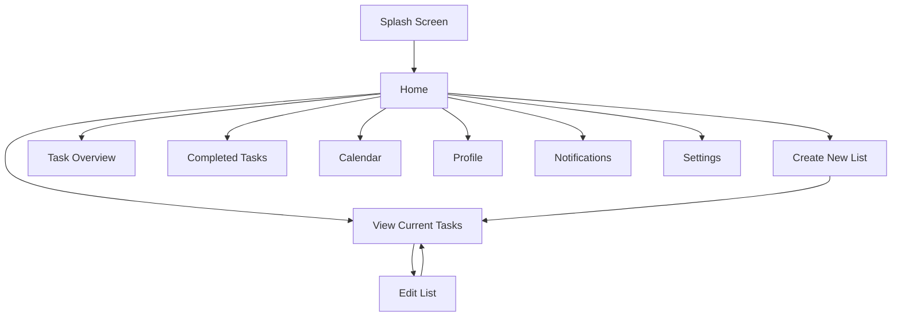

# Your Best Reminder App

Your Best Reminder App is a responsive Vanilla JavaScript reminder and to-do list web app with a pink neon-orange mobile UI. It uses only HTML, CSS, and JavaScript. There is no React, no npm, no API, and no backend.

The app can run locally with VS Code Live Server and is ready to host as a static site on Vercel.

Vercel Link: https://todolistapp-vert-kappa.vercel.app/

## Quick Start

1. Open this folder in VS Code.
2. Right-click `splashscreen.html`.
3. Choose `Open with Live Server`.
4. The app starts on the splash screen and moves to Home automatically.

## Vercel Hosting

This project includes `vercel.json`, which makes the root URL open `splashscreen.html`.

Vercel setup:

1. Upload or push this folder to a GitHub repository.
2. Import the repository into Vercel.
3. Framework preset: `Other`.
4. Build command: leave empty.
5. Output directory: leave empty or use project root.
6. Deploy.

Important: Keep `vercel.json` in the root folder so `/` opens the splash screen.

## Files

- `splashscreen.html`: animated app splash screen.
- `home.html`: main dashboard, greeting, search, today progress, category cards, random motivation card, streak, badges, sidebar.
- `create_list.html`: create a new task/list.
- `edit_list.html`: edit or delete an existing task.
- `view_list.html`: active task list, task search, category filters, pending completion.
- `completed_tasks.html`: completed task history and delete tools.
- `overview.html`: task summary, weekly summary, and chart.
- `calendar.html`: calendar view with task dots.
- `profile.html`: create, edit, clear local profile, weekly summary, and encouragement quote card.
- `notifications.html`: generated task reminders with snooze buttons.
- `setting.html`: language and notification settings.
- `styles.css`: all shared styling and responsive design.
- `app.js`: all shared JavaScript logic.
- `vercel.json`: Vercel static hosting route.
- `PROJECT_REPORT.md`: fuller explanation and flow charts.

## App Flow



## Main Features

- Create, edit, delete, and complete tasks.
- Sort tasks by priority and due date.
- Filter active tasks by category: Study, Personal, Shopping, and Work.
- Home shows today's progress, active category counts, random motivation quotes with refresh, task search, streak, badges, and latest completed task.
- Daily Tasks includes a search bar for active tasks.
- Completion shows a success toast and confetti-style celebration.
- Overview includes a weekly completed-task summary.
- Notifications are generated from urgent or close-deadline tasks and can be snoozed for 1 hour or tomorrow.
- Profile shows local user details, weekly completed-task summary, and a positive encouragement quote.
- Calendar shows task marks on due dates.

## Data Storage

The app uses browser `localStorage`.

- `reminderTasks`: task list data.
- `selectedTaskIndex`: selected task for editing.
- `reminderProfile`: saved profile.
- `reminderLanguage`: language preference.
- `reminderNotificationEnabled`: notification preference.
- `reminderSnoozedNotifications`: snoozed reminder times.

Each task supports:

```js
{
  title: string,
  description: string,
  dueDate: string,
  priority: string,
  category: "Study" | "Personal" | "Shopping" | "Work",
  completed: boolean,
  completedAt: string,
  completionStatus: "Early" | "On Time" | "Late",
  createdAt: string
}
```

## Responsive Design

The layout is mobile-first. On desktop, the app is centered inside a phone-like container. On phones, the app fills the visible screen and keeps the bottom navigation visible.

The CSS uses `100dvh` on mobile so real browser address bars and bottom bars do not push the footer off-screen. The content scrolls inside the app frame, while the header and bottom navigation stay in place.

Home cards stay in a two-column layout on normal phone widths and only collapse to one column on very small screens.

## Do

- Open the app from `splashscreen.html` locally.
- Keep all files in the same folder.
- Use Live Server for local testing.
- Keep `styles.css` for CSS and `app.js` for JavaScript.
- Test create, edit, complete, delete, profile, calendar, and settings after changes.
- Test notifications on Live Server or Vercel HTTPS because browser permissions need a safe origin.

## Do Not

- Do not add React, npm, Vite, or external APIs.
- Do not rename storage keys unless you update all matching code.
- Do not move JavaScript into individual HTML pages.
- Do not remove `vercel.json` if deploying to Vercel without `index.html`.
- Do not store private or sensitive user data in `localStorage`.
